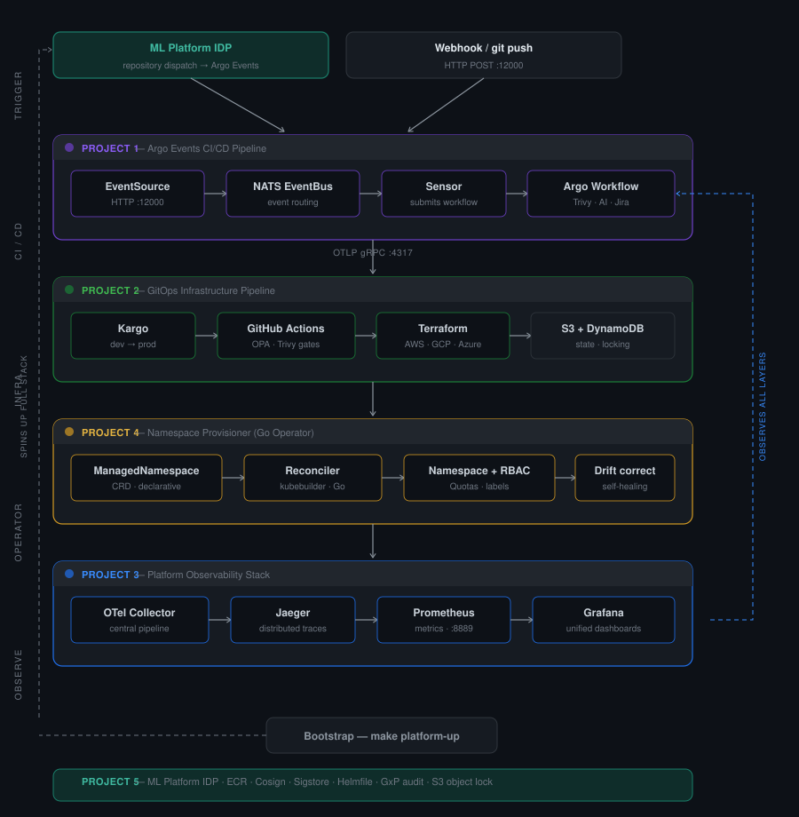
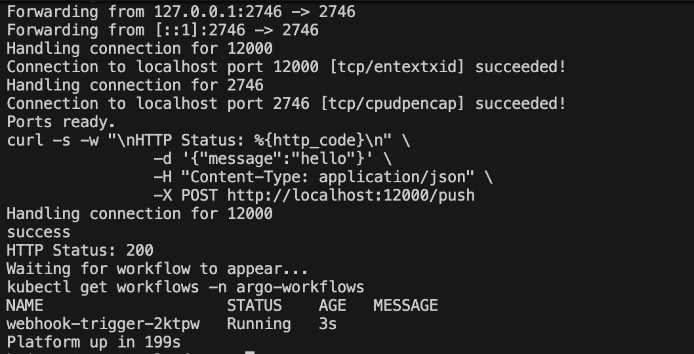

# Hi, I'm Brian 👋

Senior Platform Engineer with 11 years building the infrastructure
and tooling that development teams depend on. Cloud agnostic Kubernetes platforms,
event-driven CI/CD, GitOps automation, and observability stacks that
give teams visibility into their systems.

I build things that run without me. Then I document them well enough
that others can too.

---

## Platform Engineering Portfolio

Four connected projects forming a complete internal developer platform — event-driven
CI/CD, multi-cloud infrastructure automation, full-stack observability, and a Go
operator for policy-enforced namespace provisioning. Deployable as a single platform
via `make platform-up`.

---

### 🔧 [Argo Events CI/CD Pipeline](https://github.com/SmartBrisco/argo-event-pipeline)

Event-driven CI/CD pipeline built on Kubernetes using Argo Events and Argo Workflows.
Webhook triggers flow through a NATS event bus into a multi-step pipeline with Trivy
security scanning, Jira-style ticket integration, and an AI-powered failure analysis
layer using a locally hosted Ollama model. Emits OTLP telemetry to the observability
stack.

`Kubernetes` `Argo Events` `Argo Workflows` `NATS` `Trivy` `Ollama` `Python`

---

### ⚙️ [GitOps Infrastructure Pipeline](https://github.com/SmartBrisco/gitops-infra-pipeline)

GitHub Actions pipeline provisioning multi-cloud infrastructure via Terraform with
Kargo progressive delivery. Features OIDC authentication, OPA policy gates, Trivy
hard-fail on prod, manual approval gates, and three-channel Slack notifications.
Fully active on AWS across dev and prod; GCP and Azure scaffolded and validated.

`GitHub Actions` `Terraform` `Kargo` `AWS` `GCP` `Azure` `OPA` `OIDC` `Trivy`

---

### 📊 [Platform Observability Stack](https://github.com/SmartBrisco/platform-observability)

Full-stack observability platform deployed on Kubernetes. OpenTelemetry Collector
receives live OTLP telemetry from the Argo pipeline, routing traces to Jaeger and
metrics to Prometheus, visualized in Grafana. Isolated in a dedicated monitoring
namespace with RBAC separation from pipeline infrastructure.

`OpenTelemetry` `Jaeger` `Prometheus` `Grafana` `Kubernetes` `OTLP`

---

### 🔩 [Namespace Provisioner](https://github.com/SmartBrisco/namespace-provisioner)

Kubernetes operator in Go that enforces consistent, policy-compliant namespace
provisioning across clusters. Declarative `ManagedNamespace` CRD automatically
provisions namespaces with correct RBAC, resource quotas, and labels. Drift
correction recreates manually deleted or modified resources on the next reconciliation
cycle.

`Go` `Kubernetes` `kubebuilder` `CRD` `RBAC` `Operator pattern`

---

### 🚀 [Internal Developer Platform](https://github.com/SmartBrisco/Internal-Developer-Platform)

One command to spin up the full platform locally in under 5 minutes.

`kind` `make` `kubectl`